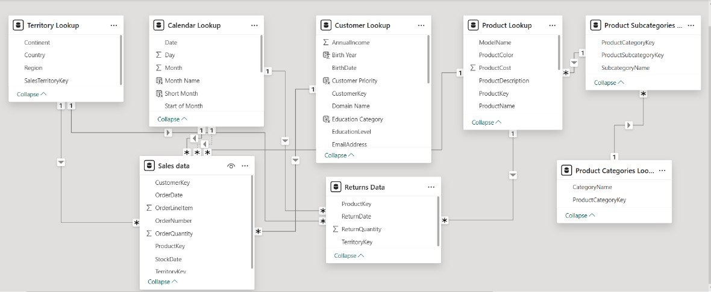
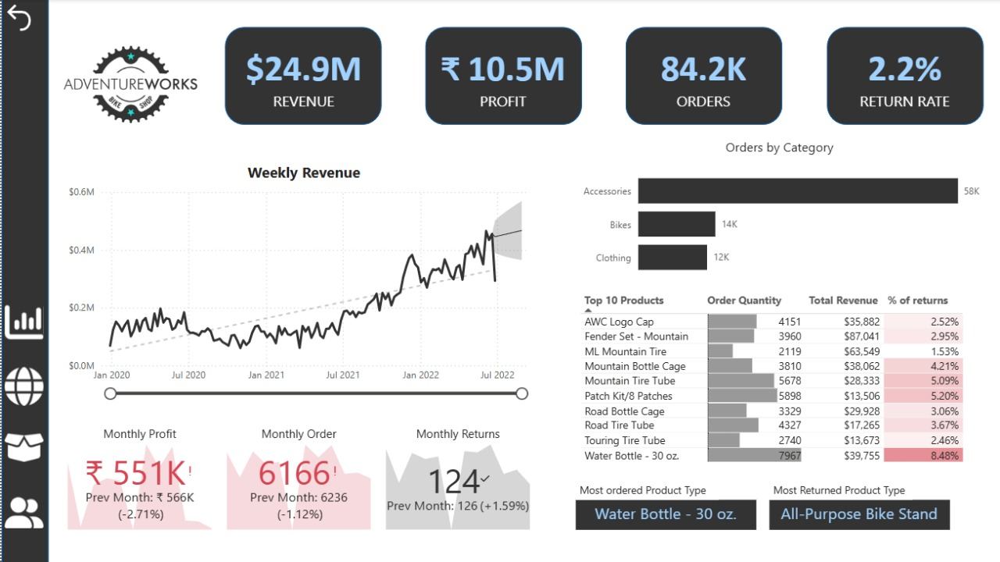
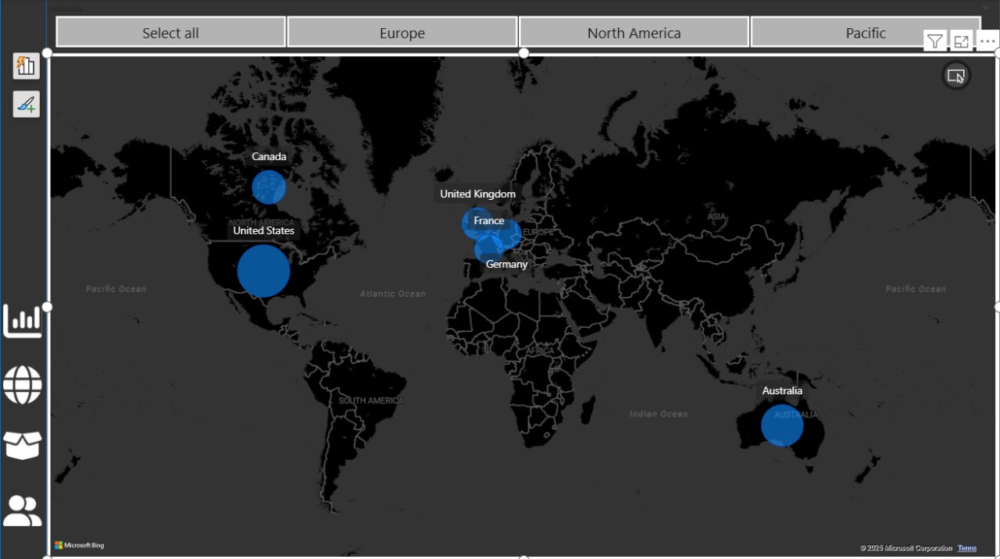
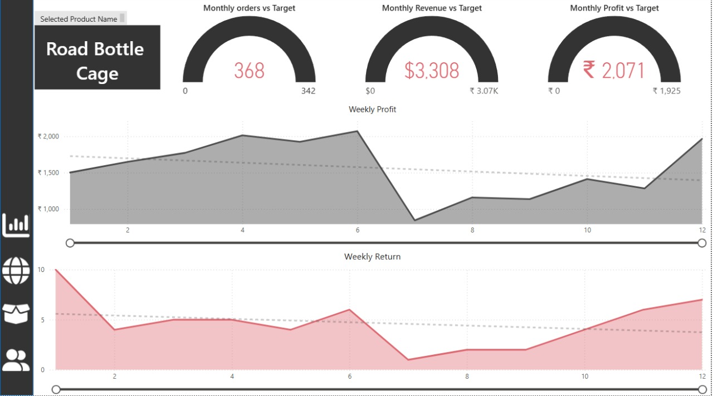
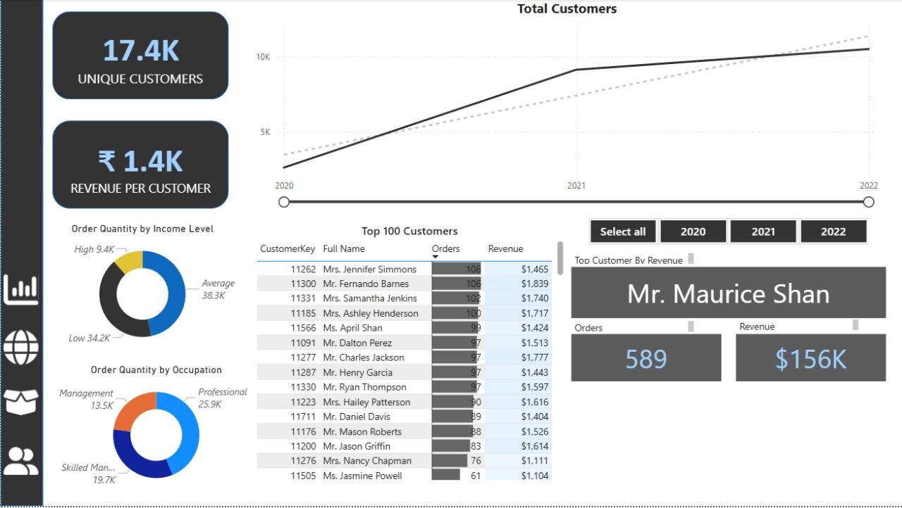

# Adventure Works Sales Insights - Project Overview
## The goal of this project is to design and deliver an interactive BI dashboard and data model that enables AdventureWorks' management to track key performance indicators (KPIs), analyze regional and product-level trends, evaluate return patterns, and identify high-value customers, using insights derived from raw transactional and customer data. 

### Tech Stack

The dashboard was built using the following tools and technologies: 
•	📊 Power BI Desktop – Main data visualization platform used for report creation. 
•	📂 Power Query – Data transformation and cleaning layer for reshaping and preparing the data. 
•	🧠 DAX (Data Analysis Expressions) – Used for calculated measures, dynamic visuals, and conditional logic. 
•	📝 Data Modeling – Relationships established among tables (resorts, snow, and data_dictionary) to enable cross-filtering and aggregation. 
•	📁 File Format – .pbix for development and .jpeg for dashboard previews.
## Dataset Structure
#### 1. Fact Tables
- **Sales Data**: Core transactional table holding individual sales records.
- **Returns Data**: Contains information about returned products.

#### 2. Dimension / Lookup Tables
- **Customer Lookup**: Information about customers and their attribrutes.
- **Product Lookup**: Describes each product and links to its category.
- **Product Subcategories Lookup**: Maps each product to a subcategory.
- **Product Categories Lookup**: High level product grouping.
- **Territory Lookup**: Geographical data related to where sales and returns occured.
- **Calendar Lookup**: Date dimension for temporal analysis.

## Insights Summary
#### In order to evaluate commercial performance for AdventureWorks’ global cycling business, we focused on the following key metrics:
- **Total Revenue:** Aggregate sales value across all transactions.
- **Profit:** Earnings after product cost (as displayed in dashboard cards).
- **Order Volume:** Number of line-level units ordered; proxy for demand.
- **Return Rate:** Percent of shipped units that are returned.
- **Regional Order Distribution:** Geographic mix and market concentration by country/territory.
- **Product Performance:** High-volume, high-revenue, and high-return SKUs that drive growth or risk.
- **Customer Value & Segmentation:** Unique customers, revenue per customer, behavioral and demographic splits.

#### Total Revenue
- Total revenue: **$24.9M**.
- Accessories are the primary volume engine and strongly influence revenue mix; sustaining accessory sell-through is critical to top-line stability.
- Revenue growth has generally trended upward since 2020, though the latest period shows a softening that should be monitored alongside order volume.

#### Profit
- Reported profit stands at **₹10.5M**, indicating healthy absolute earnings; however, the latest monthly profit slipped to ₹551K from ₹566K **(-2.71%)**.
- This month-over-month decline—while modest—coincides with lower orders and slightly higher returns, suggesting early margin pressure.

#### Order Volume
- Total orders: **84.2K**.
- Recent monthly orders fell to 6,166 from 6,236 **(-1.12%)**, hinting at a mild demand deceleration.
  
#### Return Rate
- Overall return rate is low at **2.2%**, which is positive at the macro level. That average masks SKU-level outliers:
    - Water Bottle – 30 oz. return rate: **8.48**% (also the most-ordered SKU).
    - Patch Kit: 5.20%; Mountain Tire Tube: 5.09%.
 
#### Regional Order Distribution
- The United States leads with **~30K orders**, establishing it as the anchor market.
- Australia ranks second **(~19K orders)**.

#### Product Performance
- Accessories dominate **(~58K orders)**—roughly 4x Bikes (14K) and 5x Clothing (12K)—making them the primary demand lever.
- Among Top 10 products by quantity, several low-price consumables (e.g., bottles, tubes, patch kits) generate high unit turns but also higher relative return exposure.

#### Customer Value & Segmentation
- AdventureWorks serves **17.4K** unique customers with an average revenue per customer of **~₹1.4K**.
- Customer counts increased steadily from 2020 through 2022, indicating effective acquisition and retention momentum.
- By income, the Average-income segment drives the most orders (38.3K), followed by Low-income (34.2K); High-income customers are smaller in count (9.4K).
- By occupation, Professionals lead (25.9K orders), with Skilled Manual (19.7K) and Management (13.5K) forming meaningful follow-on segments.
  

## Dashboard

#### Exceutive Dashboard

#### Geographical Distribution

#### Product Detail

#### Customer Detail

